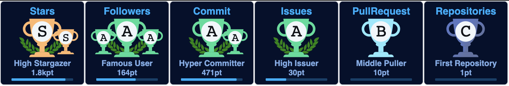

<!-- ═══════════════ HERO ═══════════════ -->

<!-- Animated gradient banner with name baked in -->

<!-- Rotating specialties -->

 

<!-- Status badges -->

&nbsp;

&nbsp;

  

<!-- 🏆 Trophies — static image from this repo, always renders -->
[]

<!-- ═══════════════ ABOUT ═══════════════ -->

## 🚀 About Me

- 🔭 Currently building **[BKOTT](https://abdullahkhaled.com)** — a multi-domain, Arabic/RTL-first e-commerce marketplace — and **BYKII ERP** at **Bykii-Tech** &nbsp;·&nbsp; `NestJS 11` `React` `PostgreSQL` `Prisma` `Turborepo`
- 🧩 Part-time **Technical Lead** @ Softa Solutions — ERP & SaaS delivery + operating a fleet of **6–15 production servers** (AWS · DigitalOcean · Hetzner · Docker)
- 🤖 Shipped an **agentic AI e-commerce assistant** — order status, payment help & support — orchestrating **OpenAI · Claude · Gemini** through **n8n / Zapier**
- 🎓 Started my career teaching: **500+ students** trained in full-stack development
- 📍 Giza, Egypt — open to **remote (EU / US / GCC)** and **relocation**
- 💬 Ask me about **Node.js, NestJS, Laravel, React, real-time systems, LLM automation**

 

<!-- ═══════════════ TECH STACK ═══════════════ -->

## 🛠️ Tech Stack

**Backend**

         

**Frontend**

      

**Mobile & Desktop**

  

**Databases**

    

**DevOps & Cloud**

     

**AI & Automation**

    

 

<!-- ═══════════════ FEATURED WORK ═══════════════ -->

## 💼 Featured Work

| Project | What it is | Stack |
|---|---|---|
| 🛒 **BKOTT** | Multi-domain e-commerce marketplace for the Egyptian market — Arabic/RTL-first, consent-compliant analytics (GA4 · Consent Mode v2 · PDPL) | `NestJS 11` `React (Vite)` `PostgreSQL` `Prisma` `Turborepo` |
| 🏢 **BYKII ERP** | HR / attendance / payroll ERP — effective-dated compensation, AES-256-GCM encrypted employee fields, ~200-table multi-tenant design | `NestJS` `Prisma` `PostgreSQL` `React` |
| 🤖 **Agentic E-Commerce Assistant** | Production AI chatbot handling order status, payment assistance & customer support + automated sales sequences | `OpenAI` `Claude` `Gemini` `n8n` `Zapier` |
| 🎓 **Testat** | Real-time online classrooms sustaining **50+ concurrent users** with live streaming | `Node.js` `Socket.io` `WebRTC` `Angular` |

> 🔒 *Product & client work — source private. Public repos and open-source contributions live below in my pinned repositories.*

<!--
  ➕ TO FEATURE A PUBLIC REPO, add a row like:
  | ⭐ **[repo-name](https://github.com/D-Abdullah/repo-name)** | One-line description | `Stack` `Here` |
-->

 

<!-- ═══════════════ GITHUB STATS ═══════════════ -->

## 📊 GitHub Stats

<!-- Live stat strip — shields.io (industrial-grade GitHub API capacity, never naps) -->

&nbsp;

&nbsp;

  

<!-- Contribution numbers — proven-reliable streak service -->

<!--
  🐍 SNAKE (optional): requires the snake.yml GitHub Action.
  If you installed it, un-comment this block:

    
  <picture>
    <source media="(prefers-color-scheme: dark)" srcset="https://raw.githubusercontent.com/D-Abdullah/D-Abdullah/output/github-contribution-grid-snake-dark.svg" />
    
  </picture>
-->

 

<!-- ═══════════════ CONNECT ═══════════════ -->

## 🤝 Connect With Me

&nbsp;

&nbsp;

  

